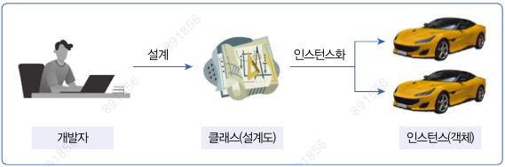
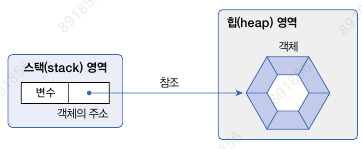
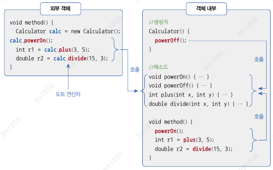
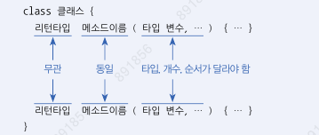

## 6.1 객체 지향 프로그래밍

### 객체
- **물리적으로 존재하거나 개념적인 것 중에서 다른 것과 식별 가능한 것**
- `필드`(속성), `메서드`(동작)
- 객체 간 관계 : 집합 관계, 사용 관계, 상속 관계
- 객체 지향 프로그래밍의 특징
  - `캡슐화` : 객체의 데이터(필드), 동작(메소드)를 하나로 묶고 실제 구현 내용을 외부에 감추는 것
  - `상속` : 부모 객체의 필드와 메소드를 자식 객체가 물려받아 사용하는 것
    - 코드 재사용성 높아짐, 유지 보수 시간 최소화
  - `다형성` : 사용 방법은 동일하지만 실행 결과가 다양하게 나오는 성질

## 6.2 객체와 클래스



## 6.4 객체 생성과 클래스 변수

```text
클래스 변수 = new 클래스();
```
 

### 클래스의 두 가지 용도
- 라이브러리(library) 클래스 : 실행할 수 없으며 다른 클래스에서 이용하는 클래스
- 실행 클래스 : main() 메소드를 가지고 있는 실행 가능한 클래스
- 일반적으로 자바 프로그램은 하나의 실행 클래스와 여러 개의 라이브러리 클래스들로 구성

## 6.6 필드 선언과 사용

### 필드 선언

```text
타입 필드명 [ = 초기값];
```
- 필드명은 첫 문자를 소문자로, 캐멀 스타일로 작성

  ```java
  // Car.java
  public class Car {
      // 필드 선언
      String model;
      boolean start;
      int speed;
  }
  
  // CarExample.java
  public class CarExample {
    public static void main(String[] args) {
        // Car 객체 생성
        Car myCar = new Car();

        // Car 객체의 필드값 읽기
        System.out.println("모델명 : " + myCar.model);
        System.out.println("시동여부 : " + myCar.start);
        System.out.println("현재속도 : " + myCar.speed);
    }
  }
  ```
### 필드 사용
- 클래스로부터 객체가 생성된 후에 필드 사용 가능
- 객체 내부의 생성자와 메소드 내부에서 사용 가능 - 단순히 필드명으로 읽고 변경 가능
- 객체 외부에서도 접근해서 사용 가능 - 참조 변수와 도트(.) 연산자 이용해서 읽고 변경 가능
  ```java
  // Car.java
  public class Car {
    // 필드 선언
    String company = "현대자동차";
    String model = "그랜저";
    String color = "검정";
    int maxSpeed = 350;
    int speed;

  }
  
  // CarExample.java
  public class CarExample {
    public static void main(String[] args) {
        // Car 객체 생성
        Car myCar = new Car();

        // Car 객체의 필드값 읽기
        System.out.println("제작회사 : " + myCar.company);
        System.out.println("모델명 : " + myCar.model);
        System.out.println("색깔 : " + myCar.color);
        System.out.println("최고속도 : " + myCar.maxSpeed);
        System.out.println("현재속도 : " + myCar.speed);

        // Car 객체의 필드값 변경
        myCar.speed = 60;
        System.out.println("수정된 속도 : " + myCar.speed);
    }
  }
  ```
## 6.7 생성자 선언과 호출
- new 연산자 -> 객체 생성후 초기화 역할
- `객체 초기화` : 필드 초기화 or 메소드 호출해서 객체 사용할 준비

### 기본 생성자
```text
[public] 클래스() { }
```
- 모든 클래스는 하나 이상의 생성자가 존재
- new 연산자 뒤에 기본 생성자 호출 가능
- 명시적으로 선언한 생성자가 있으면 컴파일러는 기본 생성자 추가하지 X

### 생성자 선언
```text
// 생성자 블록
클래스(매개변수, ...) {
// 객체 초기화 코드
}
```

```java
// Car.java
public class Car {
    // 생성자 선언
    Car(String model, String color, int maxSpeed) {
        
    }

}

// CarExample.java
public class CarExample {
  public static void main(String[] args) {
    Car myCar = new Car("팰리세이드", "하양", 250);
//  Car myCar = new Car();  // 기본 생성자 호출 못함


  }
}
```

### 필드 초기화
- 객체마다 동일한 값 -> 필드 선언시 초기값 대입
- 객체마다 다른 값 -> 생성자에서 필드 초기화

```java
// Korean.java
public class Korean {
    // 필드 선언
    String nation = "대한민국";
    String name;
    String ssn;

    // 생성자 선언 1
    public Korean(String n, String s) {
        name = n;
        ssn = s;
    }

    // 생성자 선언 2
    public Korean(String name, String ssn) {
    this.name = name;
    this.ssn = ssn;
    // 매개변수명과 필드명이 동일
    // this -> 현재 객체, this.name -> 현재 객체의 필드
  }
}

// KoreanExample.java
public class KoreanExample {
  public static void main(String[] args) {
    // Korean 객체 생성
    Korean k1 = new Korean("김성규", "870428-1234567");
    // Korean 객체 데이터 읽기
    System.out.println("k1.nation : " + k1.nation);
    System.out.println("k1.name : " + k1.name);
    System.out.println("k1.ssn : " + k1.ssn);
    System.out.println();

    // 또 다른 Korean 객체 생성
    Korean k2 = new Korean("남우현", "900208-1234567");
    // Korean 객체 데이터 읽기
    System.out.println("k2.nation : " + k2.nation);
    System.out.println("k2.name : " + k2.name);
    System.out.println("k2.ssn : " + k2.ssn);
    System.out.println();
  }
}
```

### 생성자 오버로딩
- 매개변수의 타입, 개수, 순서가 다르게 여러개의 생성자 선언

```java
// Car.java
public class Car {
    // 필드 선언
    String company = "현대자동차";
    String model;
    String color;
    int maxSpeed;

    // 생성자 선언
    Car() {

    }

    Car(String model) {
        this.model = model;
    }

    Car(String model, String color) {
        this.model = model;
        this.color = color;
    }

    Car(String model, String color, int maxSpeed) {
        this.model = model;
        this.color = color;
        this.maxSpeed = maxSpeed;
    }
}

// CarExample.java
public class CarExample {
  public static void main(String[] args) {
    Car car1 = new Car();
    System.out.println("car1.company : " + car1.company);
    System.out.println();

    Car car2 = new Car("팰리세이드");
    System.out.println("car2.company : " + car2.company);
    System.out.println("car2.model : " + car2.model);
    System.out.println();

    Car car3 = new Car("테슬라", "회색");
    System.out.println("car3.company : " + car3.company);
    System.out.println("car3.model : " + car3.model);
    System.out.println("car3.color : " + car3.color);
    System.out.println();

    Car car4 = new Car("제네시스", "검정", 250);
    System.out.println("car4.company : " + car4.company);
    System.out.println("car4.model : " + car4.model);
    System.out.println("car4.color : " + car4.color);
    System.out.println("car4.maxSpeed : " + car4.maxSpeed);

  }
}
```

### 다른 생성자 호출
- 생성자 오버로딩이 많아질 경우(중복 코드가 많을 경우) 
- 공통 코드를 한 생성자에만 집중적으로 작성하고 나머지 생성자는 `this(...)`를 사용해서 공통 코드를 가진 생성자를 호출
```java
Car(String model) {
    this(model, "은색", 250);
}

Car(String model, String color) {
    this(model, color, 250);
}

// 위의 두 코드 모두 결국은 아래 생성자를 호출함
Car(String model, String color, int maxSpeed) {
    this.model = model;
    this.color = color;
    this.maxSpeed = maxSpeed;
}
```

## 6.8 메소드 선언과 호출

### 메소드 선언
```text
리턴타입 메서드명 (매개변수, ...) {
// 실행 블록
}
```
- `void` :  리턴값이 없는 메소드
- 리턴 타입이 있는 메소드는 실행 블록 안에서 return문으로 리턴값 반드시 지정!


```java
// Calculator.java
public class Calculator {
  // 리턴값이 없는 메소드 선언
  void powerOn() {
    System.out.println("전원을 켭니다.");
  }

  // 리턴값이 없는 메소드 선언
  void powerOff() {
    System.out.println("전원을 끕니다.");
  }

  // 호출 시 두 정수 값을 전달받고,
  // 호출한 곳으로 결과값 int를 리턴하는 메소드 선언
  int plus(int x, int y) {
    int result = x + y;
    return result;  // 리턴값 지정
  }

  // 호출 시 두 정수 값을 전달받고,
  // 호출한 곳으로 결과값 double을 리턴하는 메소드 선언
  double divide(int x, int y) {
    double result = (double) x / (double) y;
    return result;  // 리턴값 지정
  }
}
```

### 메소드 호출
- `객체 내부`에서 호출할 때는 `메소드명`으로 호출
- `외부 객체`에서는 `참조 변수와 도트(.) 연산자` 이용하여 호출


```java
public class CalculatorExample {
    public static void main(String[] args) {
        // Calculator 객체 생성
        Calculator myCalc = new Calculator();

        // 리턴값이 없는 powerOn() 메소드 호출
        myCalc.powerOn();

        // plus 메소드 호출 시 5와 6을 매개값으로 제공하고,
        // 덧셈 결과를 리턴받아 result1 변수에 대입
        int result1 = myCalc.plus(5, 6);
        System.out.println("result1 : " + result1);
        int x = 10;
        int y = 4;
        // divide() 메소드 호출 시 변수 x와 y의 값을 매개값으로 제공하고,
        // 나눗셈 결과를 리턴받아 result2 변수에 대입
        double result2 = myCalc.divide(x, y);
        System.out.println("result2 : " + result2);

        // 리턴값이 없는 powerOff() 메소드 호출
        myCalc.powerOff();
    }
}
```

### 가변길이 매개변수
- 메소드 호출 시 매개값을 쉼표로 구분해서 개수 상관없이 제공 가능
- 메소드 호출 시 직접 배열을 매개값으로 제공 가능
```java
// Computer.java
public class Computer {
  // 가변길이 매개변수를 갖는 메소드 선언
  int sum(int ... values) {
    // sum 변수 선언
    int sum = 0;

    // values는 배열 타입의 변수처럼 사용
    for (int i = 0; i < values.length; i++) {
      sum += values[i];
    }

    // 합산 결과를 리턴
    return sum;
  }
}

// ComputerExample.java
public class ComputerExample {
  public static void main(String[] args) {
    // Computer 객체 생성
    Computer myCom = new Computer();

    // sum() 메소드 호출 시 매개값 1, 2, 3을 제공하고
    // 합산 결과를 리턴받아 result1 변수에 대입
    int result1 = myCom.sum(1, 2, 3);
    System.out.println("result1 : " + result1);

    // sum() 메소드 호출 시 매개값 1, 2, 3, 4, 5를 제공하고
    // 합산 결과를 리턴받아 result2 변수에 대입
    int result2 = myCom.sum(1, 2, 3, 4, 5);
    System.out.println("result2 : " + result2);

    // sum() 메소드 호출 시 배열을 제공하고
    // 합산 결과를 리턴받아 result3 변수에 대입
    int[] values = {1, 2, 3, 4, 5};
    int result3 = myCom.sum(values);
    System.out.println("result3 : " + result3);

    // sum() 메소드 호출 시 배열을 제공하고
    // 합산 결과를 리턴받아 result3 변수에 대입
    int result4 = myCom.sum(new int[] {1, 2, 3, 4, 5});
    System.out.println("result4 : " + result4);
  }
}
```

### return 문
- 메소드 실행을 강제 종료하고 호출한 곳으로 돌아간다는 뜻
```java
// Car.java
public class Car {
  // 필드 선언
  int gas;

  // 리턴값이 없는 메소드로 매개값을 받아서 gas 필드값을 변경
  void setGas(int gas) {
    this.gas = gas;
  }

  // 리턴값이 boolean인 메소드로 gas 필드값이 0이면 false를, 0이 아니면 true를 리턴
  boolean isLeftGas() {
    if (gas == 0) {
      System.out.println("gas가 없습니다.");
      return false;  // false를 리턴하고 메소드 종료
    }
    System.out.println("gas가 있습니다.");
    return true;  // true를 리턴하고 메소드 종료
  }

  // 리턴값이 없는 메소드로 gas 필드값이 0이면 return 문으로 메소드를 종료
  void run() {
    while(true) {
      if (gas > 0) {
        System.out.println("달립니다.(gas 잔량 : " + gas + ")");
        gas -= 1;
      } else {
        System.out.println("멈춥니다.(gas 잔량 : " + gas + ")");
        return;  // 메소드 종료
      }
    }
  }
}

// CarExample.java
public class CarExample {
  public static void main(String[] args) {
    // Car 객체 생성
    Car myCar = new Car();

    // 리턴값이 없는 setGas() 메소드 호출
    myCar.setGas(5);

    // isLeftGas() 메소드를 호출해서 받은 리턴값이 true일 경우 if 블록 실행
    if(myCar.isLeftGas()) {
      System.out.println("출발합니다.");

      // 리턴값이 없는 run() 메소드 호출
      myCar.run();
    }

    System.out.println("gas를 주입하세요.");

  }
}
```

### 메소드 오버로딩
- 메소드 이름은 같은데 매개변수의 `타입, 개수, 순서가 다른 `메소드를 여러개 선언하는 것
- 목적: `다양한 매개값 처리`
- 대표적인 예 : `System.out.println()`

  


```java
// Calculator.java
public class Calculator {
  // 정사각형의 넓이
  double areaRectangle(double width) {
    return width * width;
  }

  // 직사각형의 넓이
  double areaRectangle(double width, double height) {
    return width * height;
  }
}

// CalculatorExample.java
public class CalculatorExample {
  public static void main(String[] args) {
    // 객체 생성
    Calculator myCalcu = new Calculator();

    // 정사각형 넓이 구하기
    double result1 = myCalcu.areaRectangle(10);

    // 직사각형의 넓이 구하기
    double result2 = myCalcu.areaRectangle(10, 20);

    System.out.println("정사각형의 넓이 = " + result1);
    System.out.println("직사각형의 넓이 = " + result2);
  }
}
```